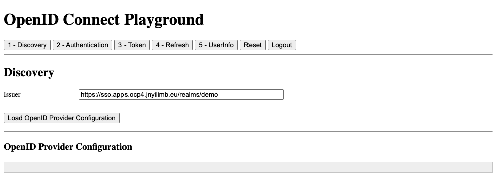

# OpenID Connect Playground

## Instructions to run locally

1. Open a terminal and optionally set the following environment variables according to your Keycloak environment:
    - **`KC_URL`**: Keycloak server root URL.
    - **`INPUT_ISSUER`**: Keycloak server realm URL that issues OIDC tokens. This can also be updated on the OpenID Connect Playground frontend UI.
    - **`OTEL_EXPORTER_OTLP_ENDPOINT`**: OpenTelemetry Collector gRPC endpoint for distributed tracing (optional).
    ```shell
    export KC_URL=<YOUR_KEYCLOAK_SERVER_ROOT_URL> # Default: http://localhost:8080/
    export INPUT_ISSUER=<YOUR_KEYCLOAK_ISSUER_REALM_URL> # Default: http://localhost:8080/realms/demo
    export OTEL_EXPORTER_OTLP_ENDPOINT=<YOUR_OTEL_COLLECTOR_GRPC_ENDPOINT> # Default: http://localhost:4317
    ```

2. Run the OIDC playground application:
    ```shell
    cd 01-OIDC
    npm install
    npm start
    ```

4. Open the playground application at http://localhost:8000

    
    
    1. Load the OpenID provider configuration by clicking on the button labelled **`Load OpenID Provider Configuration`**
    2. Click on the button labeled **`2 - Authentication`** to generate an authentication request by clicking on **`Generate Authentication Request`**. Next, click on the button labeled **`Send Authentication Request`** and you will be redirected to the Keycloak login pages. If you want to experiment a bit you can, for example, try the following steps:
        - **`Set prompt to login`**: With this value, Keycloak should always ask you to re-authenticate.
        - **`Set max_age to 60`**:  With this value, Keycloak will re-authenticate you if you wait for at least 60 seconds since the last time you authenticated.
        - **`Set login_hint to your username`**: This should prefill the username in the Keycloak login page.

        >**NOTE**: If you try any of the preceding steps, don't forget to generate and send the authentication request again to see how Keycloak behaves.

        After Keycloak has redirected back to the playground application, you will see the authentication response in the **`Authentication Response`** section. The code is what is called the **`authorization code`**, which the application uses to obtain the ID token and the refresh token.
    3. Click on the button labeled **`3 - Token`**. You will see the authorization code has already been filled in on the form so you can go ahead and click on the button labeled **`Send Token Request`**.
    4. Click on **`5 - UserInfo`** to invoke the UserInfo endpoint. Under **`UserInfo Request`**, you will see that playground application is sending a request to the Keycloak UserInfo endpoint, including the access token in the authorization header.

---

## Reset vs Logout

The playground provides two buttons to restart the flow:

| Aspect | Reset | Logout |
|--------|-------|--------|
| **Local State** | ✅ Clears localStorage | ✅ Clears localStorage |
| **Keycloak Session** | ❌ Keeps SSO session active | ✅ Terminates SSO session |
| **Browser Cookies** | ❌ Keeps Keycloak cookies | ✅ Keycloak clears its cookies |
| **Network Call** | ❌ None | ✅ Calls `end_session_endpoint` |

### When to Use Each

| Use Case | Button |
|----------|--------|
| Start over but stay logged in | **Reset** |
| Test the full login flow again | **Logout** |
| Switch to a different user | **Logout** |
| Clear UI state only | **Reset** |

### Behavior Difference

- **Reset**: App restarts at Discovery step. If you send a new authentication request, you will be **automatically logged in** (no password prompt) because the Keycloak SSO session is still active.

- **Logout**: App restarts at Discovery step. If you send a new authentication request, the **Keycloak login page appears** because the SSO session has been terminated.