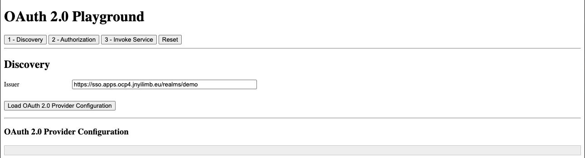

# OpenID Connect Playground

## Instructions to run locally

1. Open two terminals

2. Start the frontend part in one terminal:
    ```shell
    cd frontend
    npm install
    npm start
    ```

2.  Start the backend part in the other terminal:
    ```shell
    cd backend
    npm install
    npm start
    ```

4. Open the playground application at http://localhost:8000

    

    1. Load the OAuth 2.0 provider configuration by clicking on the button labelled **`Load OAuth 2.0 Provider Configuration`**
    2. Click on the button labeled **`2 - Authorization`**. 
    3. You can leave the **`client_id`** and **`scope`** values as they are, then click on the button labeled **`Send Authorization Request`**
    4. Now that the playground application has obtained an access token, try to invoke the REST API. Click on the button labeled **`3 - Invoke Service`**, then click on **`Invoke`**.
        >**NOTE**: The REST API will only grant access if the authenticated user has the **`oauth-backend:user`** client role and the access token **`aud`** claim is verified. **_Use access limitation by scope or client role assignment_**.