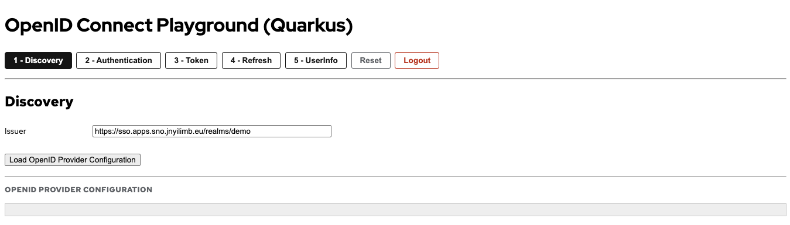

# Quarkus OIDC Playground

Interactive playground for exploring OpenID Connect authentication flows with Keycloak/RHBK, built with Quarkus.

This is a Quarkus-based implementation that provides the same functionality as the Node.js version (`nodejs/01-OIDC`), featuring step-by-step visualization of the OIDC authentication flow.

## Features

- ✅ OIDC Discovery endpoint exploration
- ✅ Authentication Request generation
- ✅ Token inspection (ID Token, Access Token, Refresh Token)
- ✅ Token refresh flow
- ✅ UserInfo endpoint testing
- ✅ Logout functionality
- ✅ Dynamic issuer configuration from backend
- ✅ Distributed tracing with OpenTelemetry
- ✅ SmallRye Health checks
- ✅ Native image support

## Prerequisites

1. **Keycloak Server** - Running instance accessible via URL
2. **Keycloak Client** - Public client configured in your realm:
   - Client ID: `quarkus-oidc-playground`
   - Client authentication: `OFF` (public client)
   - Standard flow enabled: `ON`
   - Valid Redirect URIs:
     - For local dev: `http://localhost:8080/*`
     - For OpenShift: `https://<your-openshift-route>/*`
     - Example: `https://quarkus-oidc-playground.apps.example.com/*`
   - Web Origins: `*` or specific origins (e.g., `https://<your-openshift-route>`)

## Configuration

The application uses `application.properties` for configuration. The issuer URL configured here is automatically populated in the UI on page load.

Edit `src/main/resources/application.properties`:

```properties
keycloak.url=https://your-keycloak-server
keycloak.issuer=https://your-keycloak-server/realms/your-realm
```

### Configuration Properties

- `keycloak.url`: Base URL of your Keycloak server (used for reference)
- `keycloak.issuer`: Full issuer URL (realm-specific) - **automatically loaded by the UI as the default issuer**

The UI fetches the default issuer from the backend via `GET /api/config`, ensuring a single source of truth for environment-specific configuration.

## Local Development

```bash
cd quarkus/01-OIDC

# Update application.properties with your Keycloak URL and issuer
# Run in dev mode
./mvnw quarkus:dev

# The playground will start on http://localhost:8080
```

Access the playground at `http://localhost:8080`

### With LGTM Dev Service

Quarkus automatically starts the Grafana LGTM stack when running in dev mode:

```bash
./mvnw quarkus:dev

# Access Quarkus Dev UI at http://localhost:8080/q/dev-ui
# The Grafana URL can be discovered from the Dev UI under "Observability"
```

## Building Native Images

```bash
./mvnw package -Pnative -Dquarkus.native.native-image-xmx=7g
```

>**NOTE**: The project is configured to use a container runtime for native builds. See `quarkus.native.container-build=true` in `application.properties`. Adjust the `quarkus.native.native-image-xmx` value according to your container runtime available memory resources.

>**IMPORTANT**: Native image builds require SSL support for HTTPS calls to Keycloak. This is automatically enabled via `quarkus.ssl.native=true` in `application.properties` (adds `--enable-url-protocols=http,https` to the native-image build).

You can then execute your native executable with: `./target/quarkus-oidc-playground-1.0.0-SNAPSHOT-runner`

>**NOTE**: If you're on Apple Silicon and built the native image inside a Linux container, the result is a Linux ELF binary. macOS can't execute Linux binaries, so you'll get "exec format error". Build and run the container image instead:
>
> ```bash
> podman build -f src/main/docker/Dockerfile.native -t quarkus-oidc-playground .
> podman run --rm --name quarkus-oidc-playground \
>   -p 8080:8080 \
>   -e KEYCLOAK_URL=https://sso.apps.example.com \
>   -e KEYCLOAK_ISSUER=https://sso.apps.example.com/realms/demo \
>   -e QUARKUS_OTEL_EXPORTER_OTLP_ENDPOINT=http://host.containers.internal:4317 \
>   quarkus-oidc-playground
> ```

## Deploy to OpenShift

### Pre-Deployment Configuration

Edit `src/main/kubernetes/openshift.yml`:

```yaml
---
apiVersion: v1
kind: ConfigMap
metadata:
  name: quarkus-oidc-playground-config
data:
  application.properties: |
    quarkus.otel.exporter.otlp.endpoint=http://otel-collector:4317
    keycloak.url=https://sso.apps.example.com
    keycloak.issuer=https://sso.apps.example.com/realms/demo
```

### Deploy Using Quarkus OpenShift Extension

```bash
# Login to OpenShift
oc login <your-cluster-url>

# Create or switch to your project
oc project <your-project>

# Deploy
cd quarkus/01-OIDC
./mvnw clean package -Dquarkus.openshift.deploy=true

# Get the route URL
oc get route quarkus-oidc-playground -o jsonpath='{.spec.host}'
```

**Important**: After deployment, update your Keycloak client's Valid Redirect URIs to include:
```
https://<route-from-above>/*
```

For example:
```
https://quarkus-oidc-playground.apps.example.com/*
```

## How to Use

Open the playground application at http://localhost:8080 (local dev) or `https://<your-openshift-route>` (OpenShift deployment).



1. The issuer URL is automatically populated from the backend configuration (`keycloak.issuer` property). You can override it by entering a different Keycloak issuer URL (e.g., `https://sso.example.com/realms/demo`). Load the OpenID provider configuration by clicking on the button labelled **`Load OpenID Provider Configuration`**

2. Click on the button labeled **`2 - Authentication`** to generate an authentication request by clicking on **`Generate Authentication Request`**. Next, click on the button labeled **`Send Authentication Request`** and you will be redirected to the Keycloak login pages. If you want to experiment a bit you can, for example, try the following steps:
    - **`Set prompt to login`**: With this value, Keycloak should always ask you to re-authenticate.
    - **`Set max_age to 60`**: With this value, Keycloak will re-authenticate you if you wait for at least 60 seconds since the last time you authenticated.
    - **`Set login_hint to your username`**: This should prefill the username in the Keycloak login page.

    >**NOTE**: If you try any of the preceding steps, don't forget to generate and send the authentication request again to see how Keycloak behaves.

    After Keycloak has redirected back to the playground application, you will see the authentication response in the **`Authentication Response`** section. The code is what is called the **`authorization code`**, which the application uses to obtain the ID token and the refresh token.

3. Click on the button labeled **`3 - Token`**. You will see the authorization code has already been filled in on the form so you can go ahead and click on the button labeled **`Send Token Request`**.

4. Click on **`4 - Refresh Token`** to use the refresh token and obtain new tokens.

5. Click on **`5 - UserInfo`** to invoke the UserInfo endpoint. Under **`UserInfo Request`**, you will see that the playground application is sending a request to the Keycloak UserInfo endpoint, including the access token in the authorization header.

## Reset vs Logout

The playground provides two buttons to restart the flow:

| Aspect | Reset | Logout |
|--------|-------|--------|
| **Local State** | Clears localStorage | Clears localStorage |
| **Keycloak Session** | Keeps SSO session active | Terminates SSO session |
| **Browser Cookies** | Keeps Keycloak cookies | Keycloak clears its cookies |
| **Network Call** | None | Calls `end_session_endpoint` |

### When to Use Each

| Use Case | Button |
|----------|--------|
| Start over but stay logged in | **Reset** |
| Test the full login flow again | **Logout** |
| Switch to a different user | **Logout** |
| Clear UI state only | **Reset** |

### Behavior Difference

- **Reset**: App restarts at Discovery step. If you send a new authentication request, you will be **automatically logged in** (no password prompt) because the Keycloak SSO session is still active.

- **Logout**: App restarts at Discovery step. If you send a new authentication request, the **Keycloak login page appears** because the SSO session has been terminated.

>**NOTE**: Logout calls Keycloak's `end_session_endpoint` with an `id_token_hint` parameter. The `id_token` is only issued when authenticating with the `openid` scope (OIDC). If no `id_token` is available (e.g., the token exchange was not completed), the playground will show a warning, clear local state, and skip the Keycloak logout call.

## Comparison with Node.js Version

| Feature | Node.js (`nodejs/01-OIDC`) | Quarkus |
|---------|---------------------------|---------|
| Framework | Express | Quarkus REST |
| Runtime | Node.js | JVM / Native |
| Startup Time (JVM) | ~1s | ~1-2s |
| Startup Time (Native) | N/A | ~0.01s |
| Memory (JVM) | ~50MB | ~100MB |
| Memory (Native) | N/A | ~20MB |
| OpenTelemetry | Manual setup | Built-in |
| Health Checks | Custom | Built-in (SmallRye Health) |
| Metrics | Custom | Built-in (Micrometer) |

## Health Checks

### Endpoints

- **Liveness probe**: `GET /q/health/live`
  - Checks if the application is alive and running
  
- **Readiness probe**: `GET /q/health/ready`
  - Checks if the application is ready to accept traffic

### Example

```bash
curl http://localhost:8080/q/health/live
curl http://localhost:8080/q/health/ready
```

## OpenTelemetry Tracing

The application is instrumented with OpenTelemetry for distributed tracing:

- **Service name**: `quarkus-oidc-playground`
- **Exporter**: OTLP/gRPC
- **Propagation**: W3C Trace Context

All proxy endpoints (`/api/keycloak/*` and `/api/config`) are automatically traced, enabling end-to-end visibility of OIDC flows.

## Troubleshooting

### Native Image: URL Protocol Not Enabled

If you see this error in native mode:
```
java.net.MalformedURLException: Accessing a URL protocol that was not enabled. 
The URL protocol https is supported but not enabled by default.
```

**Solution**: Add to `application.properties`:
```properties
quarkus.ssl.native=true
```

This property tells Quarkus to enable SSL support in the native image by adding `--enable-url-protocols=http,https` to the GraalVM native-image build command. This is already configured in the project.

For more details, see the [Quarkus Native and SSL guide](https://quarkus.io/version/3.27/guides/native-and-ssl).

### Invalid Redirect URI Error

If you see `invalid_redirect_uri` errors:
1. **Verify you're configuring the client in the correct realm** (check the issuer URL - e.g., `/realms/demo`)
2. Add your application URL to Valid Redirect URIs in the Keycloak client
3. Ensure the URL matches exactly (including trailing slash behavior)
4. Check Keycloak server logs for the exact error:
   ```bash
   oc logs -f <keycloak-pod> | grep -i 'invalid.*redirect'
   ```

### CORS Errors

If you see CORS errors in the browser:
1. Add your application origin to Web Origins in the Keycloak client
2. Or set Web Origins to `*` for testing

## Related Documentation

- [Quarkus OpenTelemetry](https://quarkus.io/guides/opentelemetry)
- [Quarkus OpenShift](https://quarkus.io/guides/deploying-to-openshift)
- [OpenID Connect Specification](https://openid.net/specs/openid-connect-core-1_0.html)
