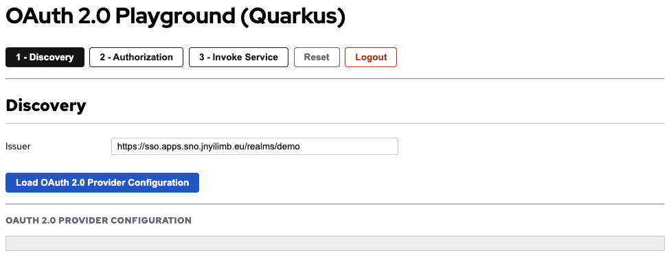

# Quarkus OAuth 2.0 Playground

An OAuth 2.0 playground with a frontend/backend architecture, built with Quarkus. The frontend uses **Qute templates** and **HTMX** for a server-rendered hypermedia UI — all interactions are handled declaratively via HTMX attributes with Qute rendering HTML fragments on the server. Zero custom JavaScript required. The backend provides secured REST endpoints with bearer token validation via the `quarkus-oidc` extension.

## Features

### Frontend

- OAuth 2.0 / OIDC Discovery endpoint exploration
- Authorization Code flow with PKCE support
- Token inspection (ID Token, Access Token, Refresh Token)
- Token refresh flow
- Backend service invocation (public and secured endpoints)
- Logout functionality
- Dynamic issuer configuration (server-side via Qute templates)
- Distributed tracing with OpenTelemetry
- SmallRye Health checks
- Native image support

### Backend

- Public REST endpoint (no authentication)
- Secured REST endpoint (bearer token + role validation)
- Token validation via Keycloak
- Client role-based access control (`quarkus-oauth-backend:user` role)
- Distributed tracing with OpenTelemetry
- SmallRye Health checks
- Native image support

## Prerequisites

1. **Keycloak Server** - Running instance accessible via URL
2. **Keycloak Clients** - Two clients configured in your realm (see [Keycloak Configuration](#keycloak-configuration))
3. **Client Role** - Create a `user` role in the `quarkus-oauth-backend` client
4. **Test User** - A user with the `quarkus-oauth-backend:user` role assigned

## Keycloak Configuration

### Frontend Client

| Setting | Value |
|---------|-------|
| Client ID | `quarkus-oauth-playground` |
| Client authentication | `OFF` (public client) |
| Standard flow enabled | `ON` |
| Valid Redirect URIs | `http://localhost:8080/*` (dev), `https://<openshift-route>/*` (OpenShift) |
| Web Origins | `*` or specific origins |

The frontend client should be configured as a **public client** in Keycloak with **Client authentication: OFF**.

### Backend Client

| Setting | Value |
|---------|-------|
| Client ID | `quarkus-oauth-backend` |
| Client authentication | `ON` (confidential client) |
| Service accounts roles | `ON` (optional) |
| Client Role | `user` (must be created manually) |

>**NOTE**: The `user` client role must be manually created under the `quarkus-oauth-backend` client in Keycloak. Then assign this role to any test user that should be granted access to the secured endpoint.

## Configuration

### Backend Configuration

Edit `quarkus/02-Oauth2/backend/src/main/resources/application.properties`:

```properties
quarkus.oidc.auth-server-url=https://your-keycloak-server/realms/your-realm
quarkus.oidc.client-id=quarkus-oauth-backend
quarkus.oidc.credentials.secret=your-backend-client-secret
```

### Frontend Configuration

Edit `quarkus/02-Oauth2/frontend/src/main/resources/application.properties`:

```properties
keycloak.issuer=https://your-keycloak-server/realms/your-realm
oauth.service.url=http://localhost:8081
```

- `keycloak.issuer`: Full issuer URL (realm-specific) — **automatically populated in the Discovery form as the default issuer**
- `oauth.service.url`: URL of the backend service (defaults to `http://localhost:8081` for local dev)

## Architecture

```
┌──────────┐      ┌─────────────────────────┐      ┌──────────────┐
│          │      │  Frontend               │      │              │
│  Browser │─────▶│  Quarkus + Qute + HTMX  │─────▶│   Keycloak   │
│          │◀─────│  (Vert.x WebClient)     │◀─────│              │
│          │ HTML │                         │ JSON │              │
└──────────┘      └──────────┬──────────────┘      └──────────────┘
                             │         │
                             ▼         │        ┌──────────────────┐
                  ┌──────────────────┐ └───────▶│                  │
                  │  Backend         │─────────▶│  OpenTelemetry   │
                  │  Quarkus REST    │          │  Collector       │
                  │  + OIDC          │          └──────────────────┘
                  └──────────────────┘
```

### Frontend

- **Server-rendered UI** with Qute templates and HTMX for dynamic partial page updates
- **Vert.x WebClient** proxies Keycloak calls for distributed tracing (BFF pattern)
- **REST API proxy endpoints** for invoking backend services with token forwarding
- **Web Bundler** manages HTMX as a Maven dependency — no npm/Node.js toolchain needed
- **Server-side session** stores OAuth flow state (no `localStorage` needed)
- **OpenTelemetry** instrumented for end-to-end tracing

### Backend

- **Public endpoint** (`GET /public`) — accessible without authentication
- **Secured endpoint** (`GET /secured`) — requires bearer token with `quarkus-oauth-backend:user` role
- **Token validation** via Keycloak OIDC extension (verifies signature, expiration, issuer, audience)
- **OpenTelemetry** instrumented for distributed tracing

## Local Development

### Backend

```bash
cd quarkus/02-Oauth2/backend

# Update application.properties with your Keycloak settings
# - quarkus.oidc.auth-server-url
# - quarkus.oidc.client-id
# - quarkus.oidc.credentials.secret

# Run in dev mode
./mvnw quarkus:dev -Dquarkus.http.port=8081

# The backend will start on http://localhost:8081
```

Endpoints:
- `GET /public` - Public message (no auth required)
- `GET /secured` - Secret message (requires `quarkus-oauth-backend:user` role)

Health endpoints:
- `GET /q/health/live` - Liveness probe
- `GET /q/health/ready` - Readiness probe

### Frontend

```bash
cd quarkus/02-Oauth2/frontend

# Update application.properties with your Keycloak settings
# - keycloak.issuer
# - oauth.service.url (backend URL, default: http://localhost:8081)

# Run in dev mode
./mvnw quarkus:dev

# Access the playground at http://localhost:8080
```

> **Note**: On the first startup in dev mode, you may see a `NoSuchFileException` for `main.css` from the Web Bundler. This is a known race condition — Quarkus live reload automatically recovers and the application starts correctly.

### With LGTM Dev Service

Quarkus automatically starts the Grafana LGTM stack when running in dev mode:

```bash
./mvnw quarkus:dev

# Access Quarkus Dev UI at http://localhost:8080/q/dev-ui (frontend)
# Access Quarkus Dev UI at http://localhost:8081/q/dev-ui (backend)
# The Grafana URL can be discovered from the Dev UI under "Observability"
```

## How to Use

Open the playground application at http://localhost:8080 (local dev) or `https://<your-openshift-route>` (OpenShift deployment).



1. **Discovery**: The issuer URL is automatically populated from the backend configuration (`keycloak.issuer` property). You can override it by entering a different Keycloak issuer URL (e.g., `https://sso.example.com/realms/demo`). Load the OAuth 2.0 provider configuration by clicking **Load OAuth 2.0 Provider Configuration**.

2. **Authorization**: Click **2 - Authorization**, leave client_id and scope as defaults, then click **Send Authorization Request**. After authenticating with Keycloak, the authorization code is automatically exchanged for tokens and the decoded access token is displayed.

3. **Invoke Service**: Click **3 - Invoke Service** to test the backend REST API:
   - **Invoke /public** — No authentication required, always returns:
     - `✓ [200]` — Public message returned successfully
   - **Invoke /secured** — Requires a valid access token with the `quarkus-oauth-backend:user` role:
     - `✓ [200]` — Access granted: the token is valid and the user has the required role
     - `✗ [401]` — Access denied: the backend rejected the token. Common causes include: no token provided, token expired, token not yet obtained (skipped the token exchange step), or the token failed validation (e.g., `aud` claim does not include the backend client ID)
     - `✗ [403]` — Access denied: the token is valid but the user does **not** have the `quarkus-oauth-backend:user` client role

>**NOTE**: A `401` response means the backend rejected the token **before** checking roles. This commonly happens when the access token's `aud` (audience) claim does not include `quarkus-oauth-backend`. In that case, you need to add an **audience mapper** in Keycloak for the frontend client to include the backend client ID in the audience. Without it, even a user with the correct role will get `401` instead of `200`.

## Building Native Images

### Backend

```bash
cd quarkus/02-Oauth2/backend
./mvnw package -Pnative -Dquarkus.native.native-image-xmx=7g
```

### Frontend

```bash
cd quarkus/02-Oauth2/frontend
./mvnw package -Pnative -Dquarkus.native.native-image-xmx=7g
```

>**NOTE**: Both projects are configured to use a container runtime for native builds. See `quarkus.native.container-build=true` in `application.properties`. Adjust the `quarkus.native.native-image-xmx` value according to your container runtime available memory resources.

>**IMPORTANT**: Native image builds require SSL support for HTTPS calls to Keycloak. The frontend enables this explicitly via `quarkus.ssl.native=true` in its `application.properties` (adds `--enable-url-protocols=http,https` to the native-image build). The backend gets SSL support automatically through the `quarkus-oidc` extension.

You can then execute your native executables with:
```bash
./target/quarkus-oauth-playground-backend-1.0.0-runner   # Backend
./target/quarkus-oauth-playground-frontend-1.0.0-runner  # Frontend
```

>**NOTE**: If you're on Apple Silicon and built the native images inside a Linux container (via `quarkus.native.container-build=true`), the results are Linux ELF binaries for ARM aarch64. macOS can't execute Linux binaries, so you'll get "exec format error". Build and run the container images instead, using `Dockerfile.native-micro` and `--platform linux/arm64` to match the binary architecture:
>
> **Backend**:
> ```bash
> cd quarkus/02-Oauth2/backend
> podman build --platform linux/arm64 -f src/main/docker/Dockerfile.native-micro -t quarkus-oauth-playground-backend .
> podman run --rm --name quarkus-oauth-playground-backend \
>   -p 8081:8080 \
>   -e QUARKUS_OIDC_AUTH_SERVER_URL=https://sso.apps.example.com/realms/demo \
>   -e QUARKUS_OIDC_CLIENT_ID=quarkus-oauth-backend \
>   -e QUARKUS_OIDC_CREDENTIALS_SECRET=your-secret \
>   -e QUARKUS_OTEL_EXPORTER_OTLP_ENDPOINT=http://host.containers.internal:4317 \
>   quarkus-oauth-playground-backend
> ```
>
> **Frontend**:
> ```bash
> cd quarkus/02-Oauth2/frontend
> podman build --platform linux/arm64 -f src/main/docker/Dockerfile.native-micro -t quarkus-oauth-playground-frontend .
> podman run --rm --name quarkus-oauth-playground-frontend \
>   -p 8080:8080 \
>   -e KEYCLOAK_ISSUER=https://sso.apps.example.com/realms/demo \
>   -e OAUTH_SERVICE_URL=http://host.containers.internal:8081 \
>   -e QUARKUS_OTEL_EXPORTER_OTLP_ENDPOINT=http://host.containers.internal:4317 \
>   quarkus-oauth-playground-frontend
> ```

## Deploy to OpenShift

### Pre-Deployment Configuration

#### Backend Configuration

Edit `quarkus/02-Oauth2/backend/src/main/kubernetes/openshift.yml`:

```yaml
---
apiVersion: v1
kind: ConfigMap
metadata:
  name: quarkus-oauth-playground-backend-config
data:
  application.properties: |
    quarkus.otel.exporter.otlp.endpoint=http://otel-collector:4317
    quarkus.oidc.auth-server-url=https://sso.apps.example.com/realms/demo
---
apiVersion: v1
kind: Secret
metadata:
  name: quarkus-oauth-playground-backend-secret
stringData:
  application.properties: |
    quarkus.oidc.credentials.secret=<your-backend-client-secret>
type: Opaque
```

#### Frontend Configuration

Edit `quarkus/02-Oauth2/frontend/src/main/kubernetes/openshift.yml`:

```yaml
---
apiVersion: v1
kind: ConfigMap
metadata:
  name: quarkus-oauth-playground-frontend-config
data:
  application.properties: |
    quarkus.otel.exporter.otlp.endpoint=http://otel-collector:4317
    keycloak.issuer=https://sso.apps.example.com/realms/demo
    oauth.service.url=http://quarkus-oauth-playground-backend:80
```

>**NOTE**: The ConfigMap and Secret resources in `openshift.yml` are automatically deployed with the application. The frontend is a public client and does not need a Secret. The backend `oauth.service.url` uses the Kubernetes service name (`quarkus-oauth-playground-backend`) for cluster-internal communication. SmallRye Health probes (liveness and readiness) are automatically configured for the OpenShift deployment.

### Deploy Using Quarkus OpenShift Extension

```bash
# Login to OpenShift
oc login <your-cluster-url>

# Create or switch to your project
oc project <your-project>

# Deploy backend first
cd quarkus/02-Oauth2/backend
./mvnw clean package -Dquarkus.openshift.deploy=true

# Deploy frontend
cd ../frontend
./mvnw clean package -Dquarkus.openshift.deploy=true

# Get the frontend route URL
oc get route quarkus-oauth-playground-frontend -o jsonpath='{.spec.host}'
```

**Important**: After deployment, update your Keycloak frontend client's Valid Redirect URIs to include:
```
https://<route-from-above>/*
```

For example:
```
https://quarkus-oauth-playground-frontend.apps.example.com/*
```

## Reset vs Logout

The playground provides two buttons to restart the flow:

| Aspect | Reset | Logout |
|--------|-------|--------|
| **Server Session** | Creates new server session | Clears server session |
| **Keycloak Session** | Keeps SSO session active | Terminates SSO session |
| **Browser Cookies** | Keeps Keycloak cookies | Keycloak clears its cookies |
| **Network Call** | None | Calls `end_session_endpoint` |

### When to Use Each

| Use Case | Button |
|----------|--------|
| Start over but stay logged in | **Reset** |
| Test the full login flow again | **Logout** |
| Switch to a different user | **Logout** |
| Clear UI state only | **Reset** |

### Behavior Difference

- **Reset**: App restarts at Discovery step. If you send a new authorization request, you will be **automatically logged in** (no password prompt) because the Keycloak SSO session is still active.

- **Logout**: App restarts at Discovery step. If you send a new authorization request, the **Keycloak login page appears** because the SSO session has been terminated.

>**NOTE**: Logout calls Keycloak's `end_session_endpoint` with an `id_token_hint` parameter. The `id_token` is only issued when authenticating with the `openid` scope (OIDC). If you authenticated without `openid` (plain OAuth 2.0), server-side logout is not available and only the local session is cleared. A message will be displayed explaining this.

## Comparison with Node.js Version

| Feature | Node.js (`nodejs/02-Oauth2`) | Quarkus |
|---------|------------------------------|---------|
| Framework | Express | Quarkus REST |
| Runtime | Node.js | JVM / Native |
| Startup Time (JVM) | ~1s | ~1-2s |
| Startup Time (Native) | N/A | ~0.01s |
| Memory (JVM) | ~50MB | ~100MB |
| Memory (Native) | N/A | ~20MB |
| OpenTelemetry | Manual setup | Built-in |
| Health Checks | Custom | Built-in (SmallRye Health) |
| Metrics | Custom | Built-in (Micrometer) |

## Health Checks and Metrics

### Health Endpoints

Both frontend and backend expose health endpoints:

- **Liveness probe**: `GET /q/health/live` — Checks if the application is alive and running
- **Readiness probe**: `GET /q/health/ready` — Checks if the application is ready to accept traffic

### Example

```bash
# Backend health checks
curl http://localhost:8081/q/health/live
curl http://localhost:8081/q/health/ready

# Frontend health checks
curl http://localhost:8080/q/health/live
curl http://localhost:8080/q/health/ready
```

### Metrics

Both applications expose Micrometer metrics at `GET /q/metrics`.

## OpenTelemetry Tracing

Both frontend and backend are instrumented with OpenTelemetry for distributed tracing:

- **Frontend service name**: `quarkus-oauth-playground-frontend`
- **Backend service name**: `quarkus-oauth-playground-backend`
- **Exporter**: OTLP/gRPC
- **Propagation**: W3C Trace Context

### Trace Flow

```
Browser → Frontend (Vert.x WebClient) → Keycloak
                    ↓
              Backend (REST)
```

All Keycloak proxy calls (discovery, token exchange, logout) and backend service invocations use Vert.x WebClient / REST Client with automatic trace propagation, enabling end-to-end visibility of OAuth/OIDC flows.

### LGTM Stack

When running in dev mode, Quarkus automatically starts the Grafana LGTM (Loki, Grafana, Tempo, Mimir) stack for observability. Access the Grafana dashboard URL from the Quarkus Dev UI (`/q/dev-ui`).

## Troubleshooting

### Invalid Redirect URI Error

If you see `invalid_redirect_uri` errors:
1. **Verify you're configuring the client in the correct realm** (check the issuer URL - e.g., `/realms/demo`)
2. Add your application URL to Valid Redirect URIs in the Keycloak frontend client
3. Ensure the URL matches exactly (including trailing slash behavior)
4. Check Keycloak server logs for the exact error:
   ```bash
   oc logs -f <keycloak-pod> | grep -i 'invalid.*redirect'
   ```

### 403 Forbidden on Secured Endpoint

If the secured endpoint returns `403 Forbidden`:
1. **Check client role assignment**: Ensure the test user has the `user` client role under `quarkus-oauth-backend`
2. **Check audience claim**: The access token must include `quarkus-oauth-backend` in the `aud` claim. You may need to configure an **audience mapper** in the Keycloak frontend client to add the backend client ID to the audience
3. **Verify scope**: The `openid` scope should be included in the authorization request for OIDC-compliant token issuance
4. Inspect the access token payload (shown in the Token step) to verify the `realm_access.roles` or `resource_access.quarkus-oauth-backend.roles` claims

### Token Validation Failed

If the backend rejects tokens:
1. Verify `quarkus.oidc.auth-server-url` in backend `application.properties` matches the issuer in the token
2. Ensure the backend client secret is correct
3. Check that the Keycloak server is accessible from the backend (network/firewall)
4. Inspect the backend logs for detailed validation error messages:
   ```bash
   oc logs -f <backend-pod>
   ```

## Technology Stack

- **[Quarkus](https://quarkus.io/)** — Supersonic Subatomic Java framework
- **[HTMX](https://htmx.org/)** — High power tools for HTML (hypermedia-driven interactions)
- **[Qute](https://quarkus.io/guides/qute)** — Quarkus templating engine
- **[Quarkus Web Bundler](https://docs.quarkiverse.io/quarkus-web-bundler/dev/)** — Zero-config frontend bundling
- **[Quarkus OIDC](https://quarkus.io/guides/security-oidc-bearer-token-authentication)** — Bearer token validation (backend)
- **[Vert.x WebClient](https://vertx.io/docs/vertx-web-client/java/)** — Reactive HTTP client (frontend)
- **[OpenTelemetry](https://quarkus.io/guides/opentelemetry)** — Distributed tracing

## Related Documentation

- [Quarkus OIDC Bearer Token Authentication](https://quarkus.io/guides/security-oidc-bearer-token-authentication)
- [Quarkus Web Bundler](https://docs.quarkiverse.io/quarkus-web-bundler/dev/)
- [Quarkus Qute Templating](https://quarkus.io/guides/qute-reference)
- [HTMX Documentation](https://htmx.org/docs/)
- [Quarkus OpenTelemetry](https://quarkus.io/guides/opentelemetry)
- [Quarkus OpenShift](https://quarkus.io/guides/deploying-to-openshift)
- [OpenID Connect Specification](https://openid.net/specs/openid-connect-core-1_0.html)
